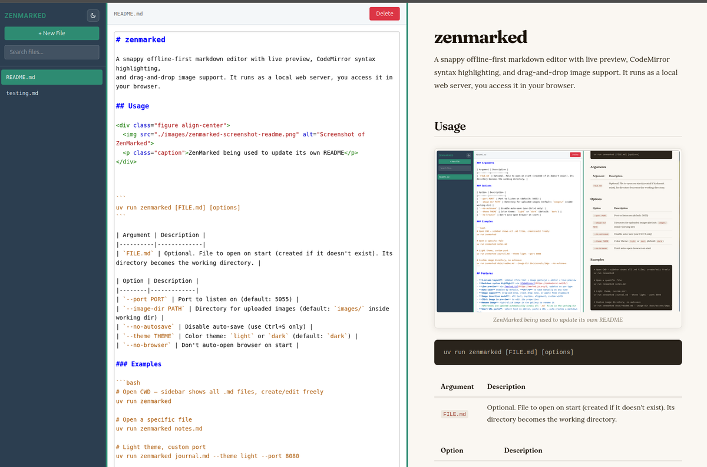
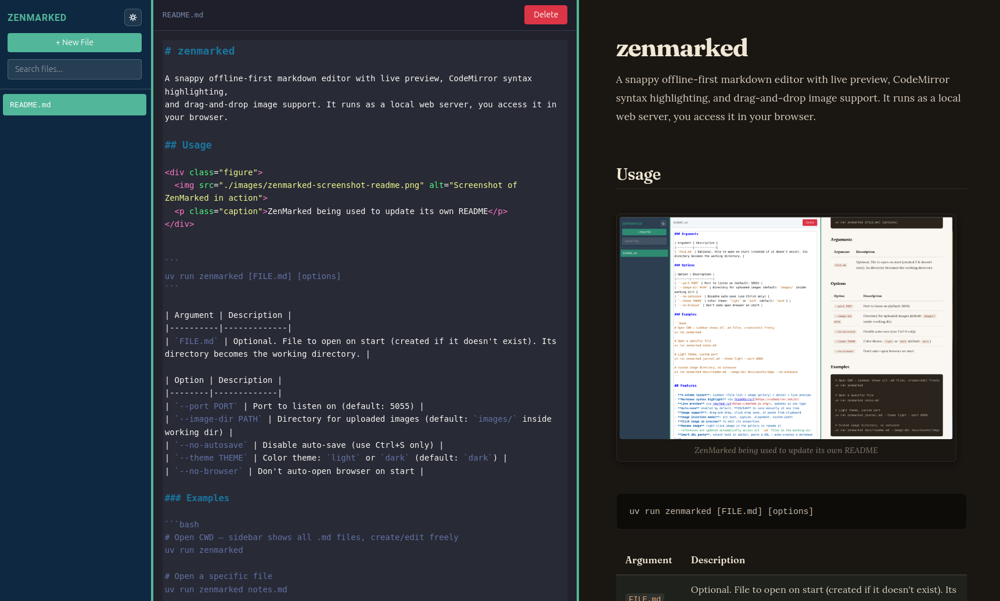

# zenmarked

A snappy offline-first markdown editor featuring:

* live preview via [marked.js](https://marked.js.org/)
* images support: add with drag-and-drop or paste from clipboard
* syntax highlighting via [CodeMirror](https://codemirror.net/5/)
* user-friendly shortcuts

It runs as a local web server, you access it in your browser.

<div class="figure">
  
  <p class="caption">ZenMarked being used to update its own README</p>
</div>

## Installation

You can install with:

    pip install zenmarked

If you use [uv](https://docs.astral.sh/uv/), you can install it with:

    uv tool install zenmarked

Or skip installation and just use it through uvx like so: `uvx zenmarked`

## Usage

```
zenmarked [FILE.md] [options]
```

| Argument | Description |
|----------|-------------|
| `FILE.md` | Optional. File to open on start (created if it doesn't exist). Its directory becomes the working directory. |

| Option | Description |
|--------|-------------|
| `--port PORT` | Port to listen on (default: auto-assign) |
| `--image-dir PATH` | Directory for uploaded images (default: `images/` inside working dir) |
| `--no-autosave` | Disable auto-save (use Ctrl+S only) |
| `--theme THEME` | Color theme: `light` or `dark` (default: `dark`) |
| `--no-browser` | Don't auto-open browser on start |

### Examples

```bash
# Open CWD — sidebar shows all .md files, create/edit freely
zenmarked

# Open a specific file
zenmarked notes.md

# Light theme, custom port
zenmarked journal.md --theme light --port 8080

# Custom image directory, no autosave
zenmarked docs/readme.md --image-dir docs/assets/imgs --no-autosave
```


## Screenshots


<div class="figure">
  
  <p class="caption">Dark mode</p>
</div>


## Features

- **3-column layout**: sidebar (file list + image gallery) + editor + live preview
- **Markdown syntax highlight** via [CodeMirror](https://codemirror.net/5/)
- **Live preview** via [marked.js](https://marked.js.org/), updates as you type
- **Auto-save** enabled by default, **Ctrl+S** to save manually at any time
- **Image support**: drag-and-drop, click drop zone, or paste from clipboard
- **Image insertion modal**: alt text, caption, alignment, custom width
- **Click image in preview** to edit its properties
- **Rename image** right-click image in the gallery to rename it
  - references are updated automatically across all `.md` files in the working dir
- **Smart URL paste**: select text in editor, paste a URL → auto-creates a markdown link
- **Light / Dark themes**


## Image paths

Images are stored in `./images/` (relative to the working directory) by default,
and inserted into markdown as `./images/filename.png`.

The image target directory can be overriden through option `--image-dir PATH`


## Keyboard shortcuts

| Shortcut | Action |
|----------|--------|
| `Ctrl+S` | Save current file |
| `Alt+N` | Create new file |
| `Escape` | Close modals |
